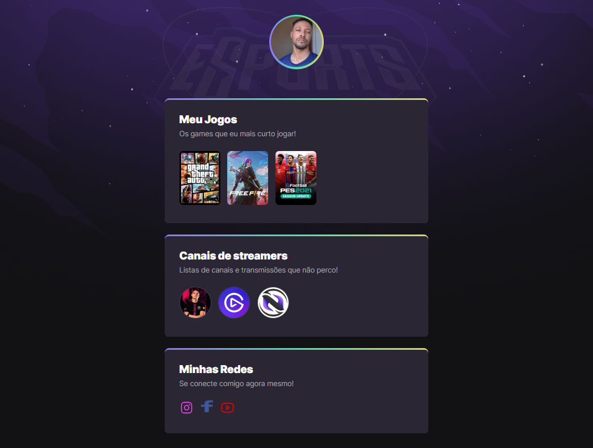

# NLW eSports 

> Trilha Explorer

Projeto construído no evento Next Level Week da Rocketseat.

[🔗 Clique aqui para acessar](https://will-ifes.github.io/Dev_Rocket/)

## 😍 Tecnologias 🔨🔧

- HTML
- CSS
- Git e Github

## 🤔 O que aprendi ?

Aprendi a como estruturar e criar uma página HTML a partir do zero, depois vi como estilizar essa página com o CSS, criando camadas por caixas com Grid e Flexbox, criando bordas, preenchimentos, fundos, alterando cores, animações e muito mais, por fim aprendi a criar um link público da minha página da Web com o GitHub, entre outras coisas...

## 💙 Contato

wildembergdejesusolieira@gmail.com