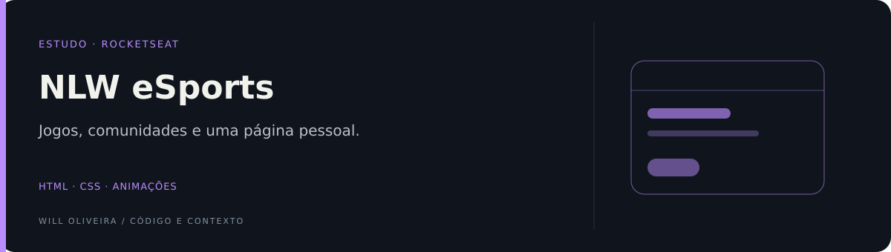
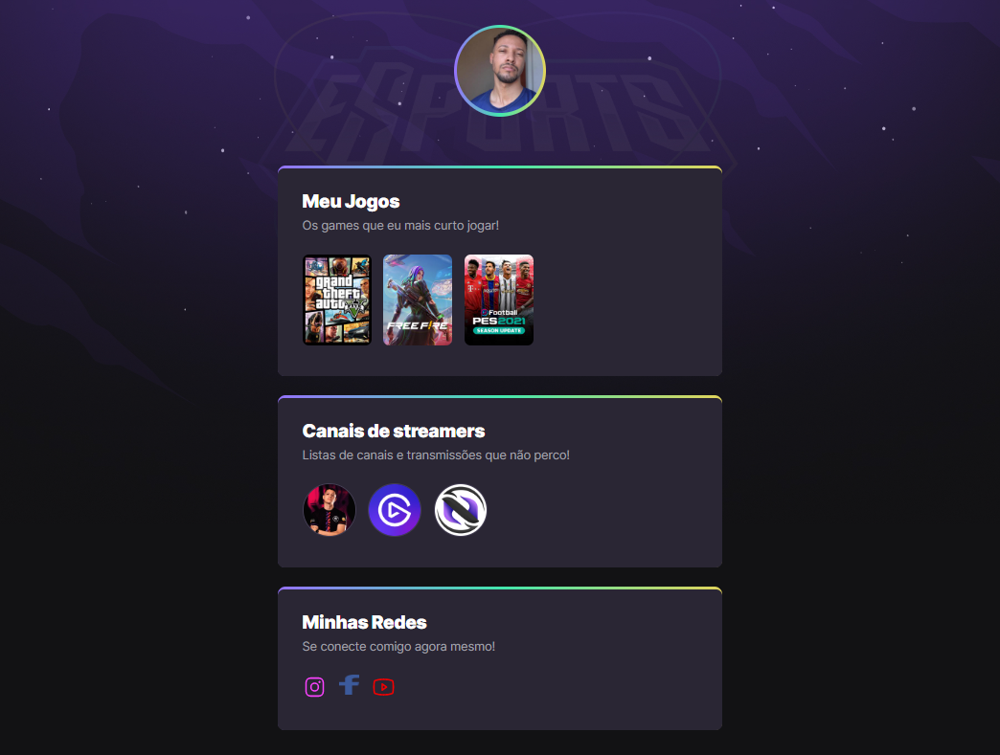

<p align="center">
  
</p>

# NLW eSports · página pessoal

Página com jogos favoritos, canais de streaming e links sociais, construída na trilha Explorer do evento Next Level Week da Rocketseat.

**HTML · CSS**



Projeto de formação da Rocketseat, personalizado durante meu aprendizado de HTML e CSS. Não representa um produto comercial.

## Explore o diferencial

| Ponto de entrada | O que observar |
| --- | --- |
| [Composição visual](styles.css) | Veja como seções e cartões organizam jogos, canais e redes sociais. |
| [Estrutura da página](index.html) | Listas e links dão forma ao conteúdo de uma página estática. |

## Destaques

- Organização do conteúdo em seções e listas de cartões.
- Imagens e links para jogos e canais de streaming.
- Estilização da página com caixas, espaçamentos e animações.

<details>
<summary><strong>Organização e código</strong></summary>

### Por dentro do código

| Arquivo | Responsabilidade |
| --- | --- |
| [`index.html`](index.html) | Conteúdo, links e estrutura semântica. |
| [`styles.css`](styles.css) | Layout e identidade visual. |

</details>

<details>
<summary><strong>Executar e consultar</strong></summary>

### Executar localmente

Clone o projeto e sirva a pasta com um servidor estático. Com Python 3 instalado:

```bash
git clone https://github.com/Will-Ifes/Dev_Rocket.git
cd Dev_Rocket
python3 -m http.server 8080
```

Abra http://localhost:8080. Não há instalação de dependências ou etapa de build.

</details>

<details>
<summary>Escopo e referências</summary>

A página é estática; imagens de terceiros dependem dos serviços de origem.

</details>

---

Mantido por **Will Oliveira** · [Perfil](https://github.com/Will-Ifes) · [LinkedIn](https://www.linkedin.com/in/wildemberg-de-jesus-oliveira/)
